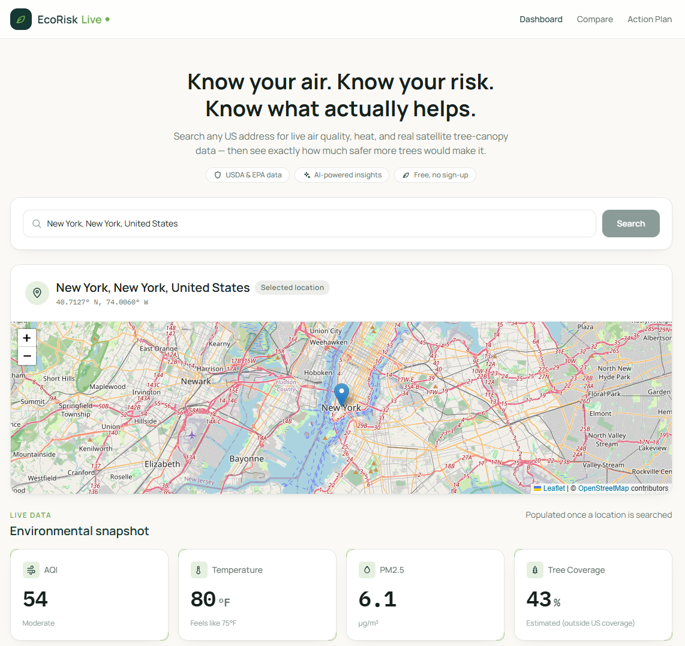

 # EcoRisk Live

**Search any location and see, in real time, how safe its air and heat conditions are — plus what would actually change if the neighborhood had more trees.**

Built for [NextStep Hacks 2026](https://nextstep2026.devpost.com/) — theme: *Earth Forward*.



**[Live demo →](https://gen-eral.github.io/nextstep/)**

---

## What it does

Environmental risk isn't distributed evenly — some neighborhoods breathe worse air, run hotter, and have far less tree canopy than others. EcoRisk Live turns public environmental data into something a resident can actually act on:

- **Live safety scoring** — search any address and get real-time AQI, PM2.5, temperature, and tree-canopy data, converted into a 0–100 safety score by a custom risk-scoring engine (`src/riskEngine.js`).
- **"What if" tree simulation** — see exactly how much a location's safety score would improve with 10% more tree coverage, grounded in real shade/filtering effects rather than a guess.
- **Location comparison** — put two neighborhoods side by side to see environmental equity gaps directly.
- **AI-generated insights** — a plain-language explanation of what's driving the score and what to do about it, with a rule-based engine that always works, layered with optional LLM-powered insights and follow-up chat when a backend or API key is configured.
- **Accessibility-minded UI** — built with keyboard navigation and screen-reader support in mind (`src/components/AccessibilityWidget.jsx`).

## Tech

- **Frontend:** React 19 + Vite + Tailwind, React Router, Leaflet for mapping
- **Risk engine:** custom scoring logic in `src/riskEngine.js` — converts raw AQI/PM2.5/temperature/tree-coverage readings into comparable 0–100 safety scores, including the tree-coverage simulation math
- **Data sources:** Photon (OpenStreetMap) for geocoding, Open-Meteo for weather and air quality, USDA Forest Service data for tree coverage (estimated outside the continental US, clearly flagged in the UI when this happens)
- **AI layer (optional):** a Python/Flask backend (`server/`) for LLM-powered insights and chat, with a rule-based fallback that requires no backend or API key at all

## Quick start

```bash
npm install
npm run dev
```

Visit the local URL Vite prints (usually `http://localhost:5173`).

No API keys are required to run the core dashboard — geocoding, weather, air quality, and rule-based insights all work out of the box against free public APIs.

### Optional: AI-powered insights and chat

By default, insights are generated by a rule-based engine that always works. To enable LLM-powered insights and chat instead:

1. Run the backend: `cd server && pip install -r requirements.txt && python app.py`
2. Point the frontend at it by creating `.env.local` in the project root:
   ```
   VITE_AI_API_URL=http://localhost:5001/api/ai-insights
   ```

**Note on deployment:** the production build intentionally does *not* bake in a client-side Anthropic API key (see `.github/workflows/deploy.yml`), since Vite inlines `VITE_*` env vars into the public JS bundle. For a live, backend-free deployment with real chat, set a strict spending cap on the key in the Anthropic Console before adding it back to the workflow — otherwise the dashboard simply falls back to rule-based insights, which is the safer default.

## Project structure

```
src/
  App.jsx              # Dashboard, Compare, Action Plan, About pages + routing
  riskEngine.js         # Core safety-scoring logic
  lib/api.js             # Geocoding, weather, air quality, tree coverage fetching
  lib/ai.js               # Rule-based + optional LLM insights, chat
  components/            # UI components (search, map, cards, accessibility widget, chat)
server/
  app.py                 # Optional Flask backend for LLM-powered insights/chat
```

## Built during NextStep Hacks 2026

This project was built for the *Earth Forward* track of NextStep Hacks 2026 (Aug 21 – Sep 13, 2026).